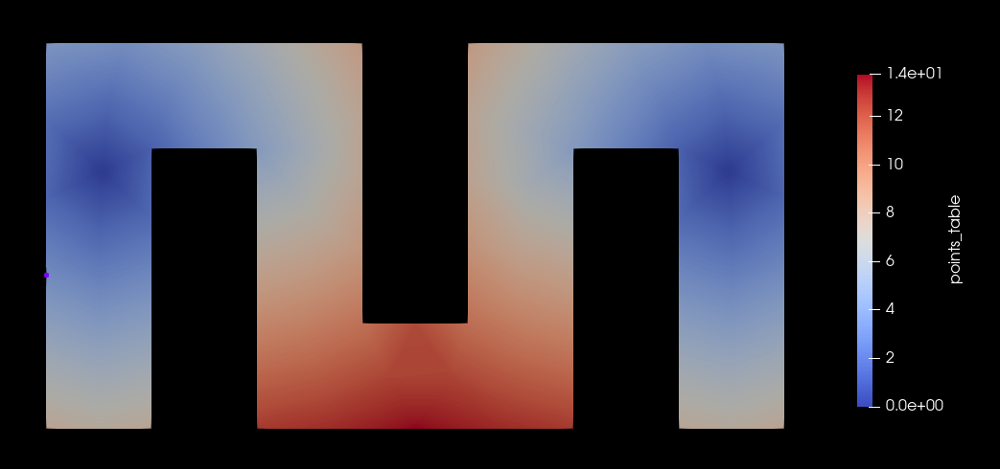
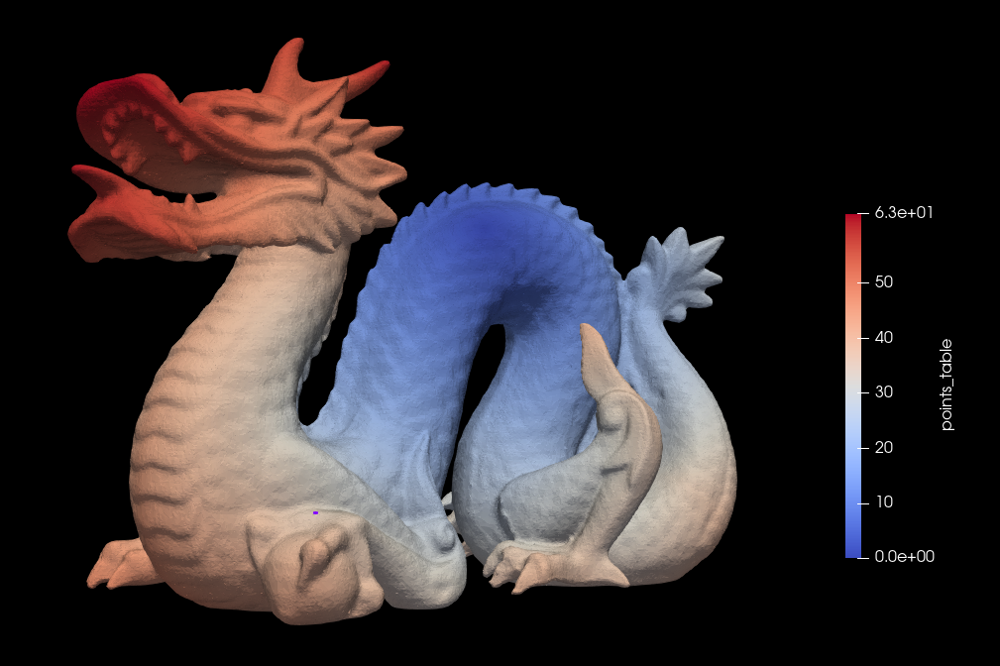
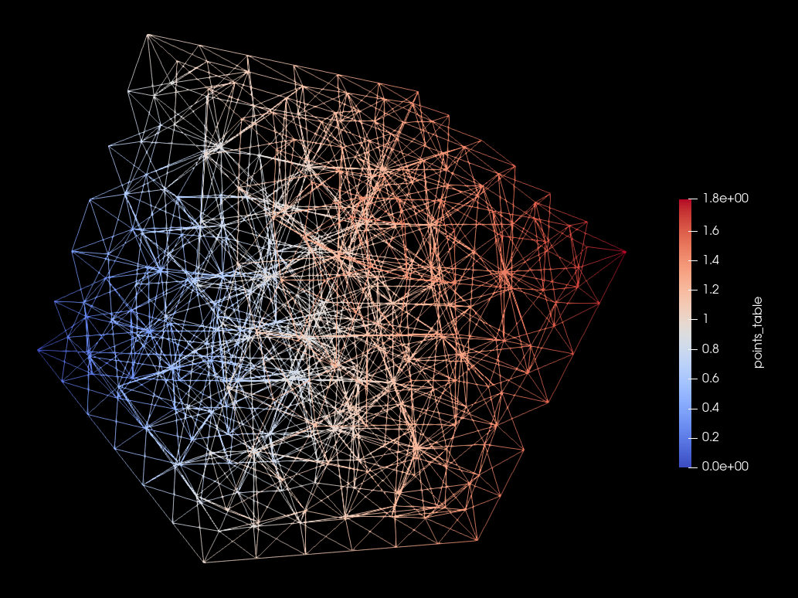

# Eikonal-Negro-Tirri-Santoro
## Overview

This is an implementation of a numerical solver for Eikonal equation.

This is part of a project-work for Advanced Method for Scientific Computing course [@Polimi](https://www.polimi.it/)

### Authors
Project developed by:
- [Negro Giorgio](https://github.com/giorgionegro)
- [Enrico Tirri](https://github.com/EnricoTirri)
- [Santoro Dario](https://github.com/DarioSantoroDS)

### Problem Specifications

The Eikonal equation is a non-linear first-order partial differential equation that is encountered in problems of wave propagation or in Hamiltonian system. It may be used to computer the continuos shortest path (geodesic) between points, electromagnetic potential, the arrival time of an acoustic wave, etc.

In most generic term, the problem is:

Find $u$ that satisfies:

$$
\begin{cases}
H(x, \nabla u(x)) = 1 & \quad x \in \Omega \subset \mathbb{R}^d \\  
u(x) = g(x) & \quad x \in \Gamma \subset \partial\Omega
\end{cases}
$$

where:
- $d$ is the dimension of the physical space
- $u : \mathbb{R}^d \to \mathbb{R}$, returns for each point of the space the travel time associated
- $H$ is an Hamiltonian operator
- $g$ is a smooth function
- $\Omega$ is the problem domain
- $\Gamma$ is a sub set the the boundaries of the domain

On most cases we have:
$$
H(x,\nabla u(x)) = \left|\nabla u(x)\right|_M = \sqrt{\nabla u(x)^TM(x)\nabla u(x)}
$$

where M is a symmetric positive definite function.

In the simplest cases $M = c^2I$, so the problem reads simply:

$$
\begin{cases}
\left|\nabla u(x)\right| = 1/c & \quad x \in \Omega\\
u(x) = g(x) & \quad x\in \Gamma \subset \partial\Omega
\end{cases}
$$

where $c$ represents the celerity of the wave.

### File Structure

* `include` -  headers files where:
    * `Mesh.h` - defines the data structure containing the mesh
    * `VtkParser.hpp` - defines data structure and methods in order to parse a .vtk file
    * `MeshLoader.hpp` - defines methods in order to load a mesh from a file parser
    * `EikonalSolver.hpp` - defines Eikonal global solver
* `LocalProblem` - Eikonal local solver library, created by [prof. Formaggia Luca](https://github.com/lformaggia) and modified to accomodate all combination of space dimension and mesh (triangular or tetrahedral)
* `src` - source file of headers implementation


### How to build

In order to build the executable, from the root folder run the following commands:

```bash
$ mkdir build
$ cd build
$ cmake .. _FLAGS_
$ make
```
`_FLAGS_` are optional, they can be:
* `-D EIGEN_PATH='/path/to/eigen3'` - specify eigen3 library path
* `-D OMP_NUM_THREADS=_num_threads_` - specify the number of threads used by omp implementation
* `-D VERBOSE=true/false` - specify if show vtk parser and mesh loader work-messages
* `-D VERBOSE_SOLVER=true/false` - specify if show local solver work-messages
* `-D METHOD=_METHOD_TAG_` - specify the solver method that has to be compiled (default = FMM)
* `-D EXE_NAME='_exe_filename_'` - specify the executable filename (default = eikonal_solver_'method_tag')

`_METHOD_TAG_` are:
* `FMM` - Fast Marching Method
* `FMMP` - Fast Marching Omp-Parallel Method
* `FMMP2` - Fast Marching Omp-Parallel Method V2

### How to run

```bash
$ ./eikonal_solver_* input.vtk output.vtk pointdim meshdim id1 [id2 ...]
```
where:
* `input.vtk` - is a path/filename to ASCII formatted .vtk input mesh file
* `output.vtk` - is the path/filename where output (mesh + data) will be placed
* `pointdim` - is the space dimension (2=2D space, 3=3D space)
* `meshdim` - is the mesh size (3=triangular mesh, 4=tetrahedral mesh)
* `id1` - the .vtk point index of wave starting point [$u(id_1) = 0$]
* `[id2 ...]` - optional list of other starting points

### Examples showcase 


#####Triangular Mesh on 2D space




#####Triangular Mesh on 3D space



#####Tetrahedral Mesh on 3D space